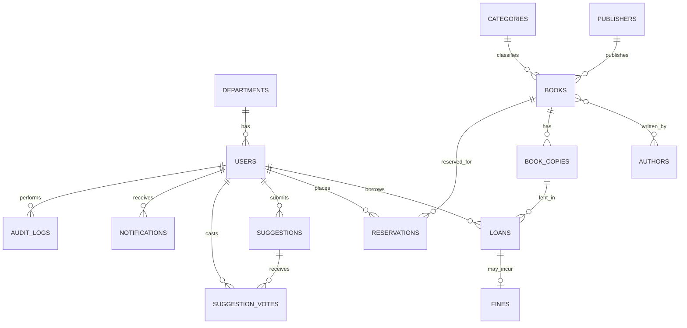

# ER Diagram (Conceptual)
**Status:** Planned — conceptual draft. Exact fields are finalized during database design.

## Notes
- `book_authors` is the join table for the many-to-many Book–Author relation.
- Loans reference **copies**, not books (see [ADR-005](../03-architecture/architecture-decisions/adr-005-book-copy-model.md)).
- Reservations refer to a book (and possibly a specific copy) — final choice pending.
- Possible future entities (do not add prematurely): `waitlist_entries`, `book_ratings`, `book_reviews`, `library_locations`, `shelves`, `acquisition_requests`, `system_settings`, `sessions`.
