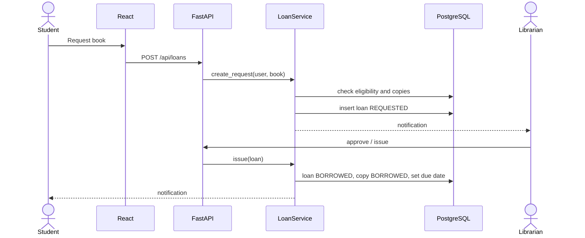
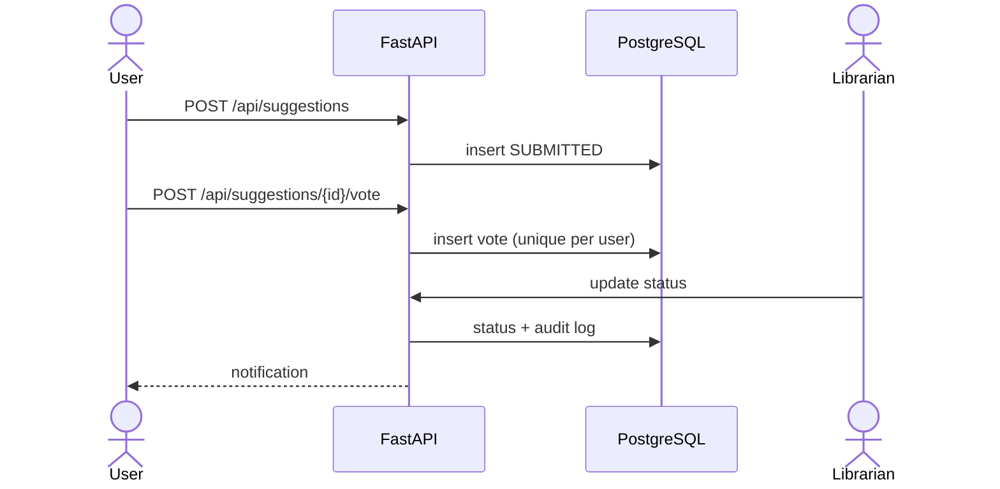

# Sequence Diagrams
**Status:** Planned

## Borrow request and approval

```mermaid
sequenceDiagram
    actor U as Student
    participant FE as React
    participant API as FastAPI
    participant SVC as LoanService
    participant DB as PostgreSQL
    actor L as Librarian
    U->>FE: Request book
    FE->>API: POST /api/loans
    API->>SVC: create_request(user, book)
    SVC->>DB: check eligibility and copies
    SVC->>DB: insert loan REQUESTED
    SVC-->>L: notification
    L->>API: approve / issue
    API->>SVC: issue(loan)
    SVC->>DB: loan BORROWED, copy BORROWED, set due date
    SVC-->>U: notification
```

## Suggestion and vote

```mermaid
sequenceDiagram
    actor U as User
    participant API as FastAPI
    participant DB as PostgreSQL
    actor L as Librarian
    U->>API: POST /api/suggestions
    API->>DB: insert SUBMITTED
    U->>API: POST /api/suggestions/{id}/vote
    API->>DB: insert vote (unique per user)
    L->>API: update status
    API->>DB: status + audit log
    API-->>U: notification
```
