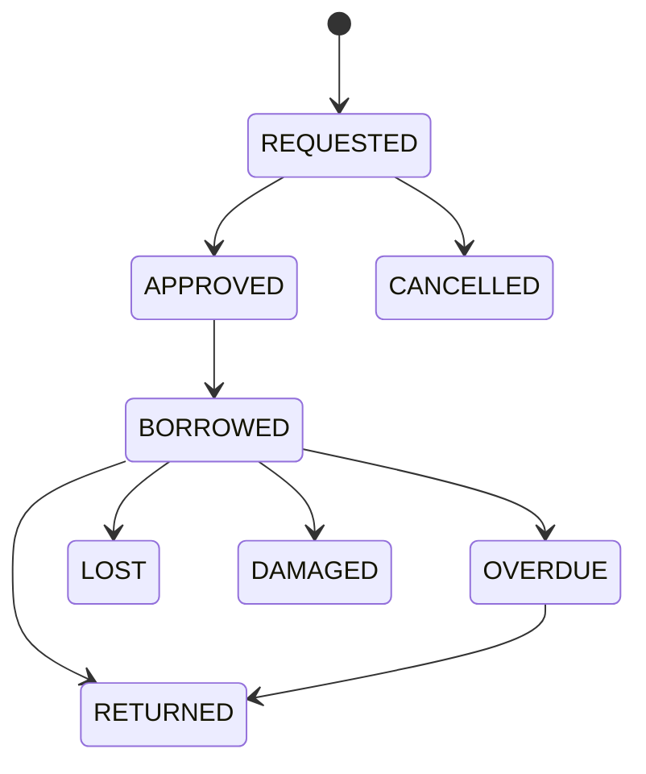
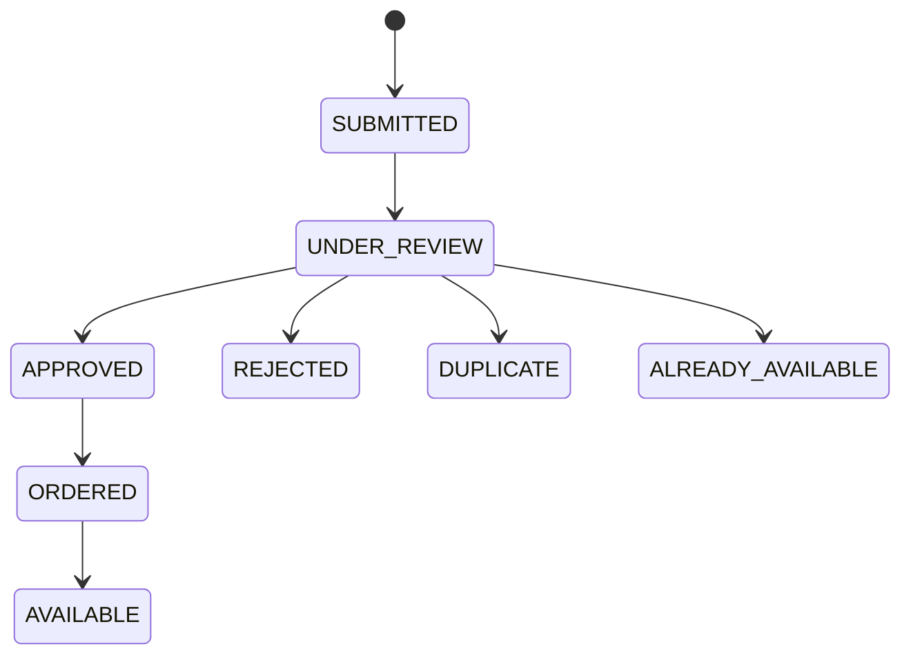

# State Diagrams
**Status:** Planned

## Loan

## Book copy
`AVAILABLE`, `BORROWED`, `RESERVED`, `LOST`, `DAMAGED`, `MAINTENANCE`, `WITHDRAWN`. Typical path: AVAILABLE → BORROWED → AVAILABLE; a returned copy may go to DAMAGED/MAINTENANCE; retired copies become WITHDRAWN.

## Suggestion

Exact allowed transitions are to be confirmed during design.
