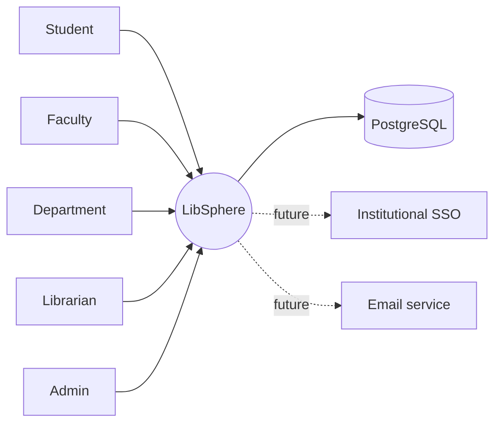

# System Context Diagram
**Status:** Planned

```mermaid
flowchart LR
    S[Student] --> L((LibSphere))
    F[Faculty] --> L
    D[Department] --> L
    B[Librarian] --> L
    A[Admin] --> L
    L --> DB[(PostgreSQL)]
    L -.future.-> SSO[Institutional SSO]
    L -.future.-> EM[Email service]
```
Dotted lines are future scope; **no MITRC SSO or email system is assumed to exist.**
